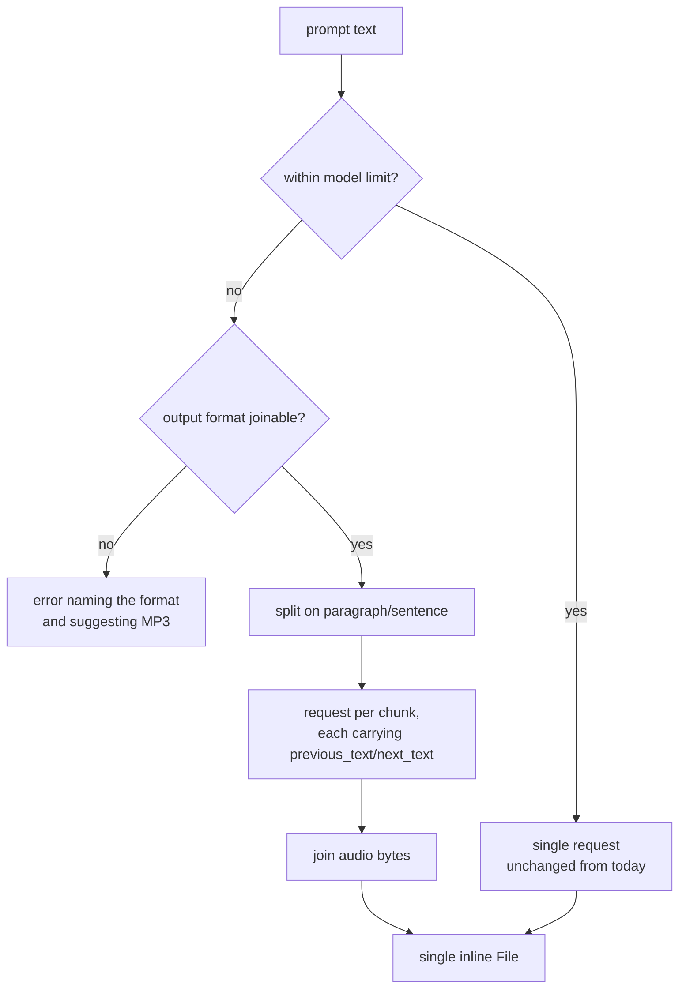

# feat: Long-form narration and honest custom options

## Summary

Make the provider honour the options it already advertises, and let it narrate a
full WordPress post instead of failing once the text exceeds the model's
per-request character limit.

---

## Problem Frame

Two defects sit behind what looks like a feature request.

**Advertised options are silently dropped.** Both models declare
`SupportedOption(OptionEnum::customOptions())` in their metadata, which tells the
AI Client that a caller may pass provider-specific parameters. Neither model
honours that. The text-to-speech model reads `output_format` and four voice
settings; the sound generation model reads `duration_seconds` and
`prompt_influence`. Everything else a caller passes is discarded without error.
The SDK's own convention, in
`vendor/wordpress/php-ai-client/src/Providers/OpenAiCompatibleImplementation/AbstractOpenAiCompatibleImageGenerationModel.php`,
is to merge all custom options into the request and raise on conflict.

Parameters currently unreachable include `language_code`, `seed`,
`apply_text_normalization`, `pronunciation_dictionary_locators`, the `speed`
voice setting, and `previous_text` / `next_text`.

**Long text fails.** ElevenLabs caps characters per request, and the cap varies
sharply by model. Measured against the live `/v1/models` endpoint:

| Model | Max characters per request |
|---|---|
| `eleven_v3` | 5,000 |
| `eleven_multilingual_v2` (our default) | 10,000 |
| `eleven_turbo_v2` / `eleven_flash_v2` | 30,000 |
| `eleven_turbo_v2_5` / `eleven_flash_v2_5` | 40,000 |

The provider sends the whole prompt regardless. On the default model that is
roughly 1,500-2,000 words, which many posts exceed, and the failure surfaces as
a raw API error. `maximum_text_length_per_request` is present in the `/models`
response the metadata directory already fetches, and is discarded during parsing.

These interlock: the parameters that make chunked narration sound continuous are
among the ones being dropped.

---

## Requirements

- R1. Custom options a caller passes reach the ElevenLabs request, or fail loudly, never silently vanish.
- R2. `speed` is settable as a voice setting.
- R3. Text longer than the selected model's limit produces complete audio rather than an API error.
- R4. Chunked audio is returned as a single file, because `GenerativeAiResult::toFile()` reads only the first candidate.
- R5. Chunk seams use the API's continuity parameters so joins are not audibly abrupt.
- R6. Behaviour is unchanged for text that already fits, including the request count.

---

## Scope Boundaries

- No new AI Client capabilities. Music and speech-to-text have no contract in the SDK to implement against; that is upstream work and out of scope here.
- No streaming endpoints. The SDK's text-to-speech contract is synchronous and returns a complete result.
- No dubbing, voice design, audio isolation, or Audio Native embedding.
- No conversational-AI surface (agents, conversations, knowledge base, workspace).
- Not changing how a voice is selected. Automatic voice resolution shipped in 0.3.0 and stays as is.

### Deferred to Follow-Up Work

- Pronunciation dictionary *management* (create, list, rules). Using an existing dictionary is covered by R1; managing them is a separate helper in the shape of `src/Voices/VoiceDirectory.php`.
- Per-chunk progress reporting or async narration of very long posts.
- **A WAV request does not return WAV.** Noticed while confirming format joinability, and pre-existing rather than introduced here. `MIME_TYPE_TO_OUTPUT_FORMAT` maps `audio/wav` to `pcm_44100`, and the response is then labelled `audio/pcm`, so a caller asking for WAV receives headerless PCM under a different MIME type. Raw PCM will not play in most players that accept WAV. Fixing it means either emitting a real WAV container or refusing the format; both are out of scope for this plan but should not be lost.

---

## Context & Research

### Relevant Code and Patterns

- `src/Models/ProviderForElevenLabsTextToSpeechModel.php` -- builds the request body; `resolveVoiceSettings()` and `resolveOutputFormat()` are the current allowlists, and `extractTextFromPrompt()` concatenates message text with no length awareness.
- `src/Models/ProviderForElevenLabsSoundGenerationModel.php` -- same allowlist pattern, smaller surface.
- `src/Metadata/ProviderForElevenLabsModelMetadataDirectory.php` -- parses `/models`; `parseResponseToModelMetadataList()` is where the length limit is currently dropped, and `FALLBACK_MODELS` is the offline path when the key lacks `models_read`.
- `src/Voices/VoiceDirectory.php` -- the established pattern for provider state that `ModelMetadata` cannot carry: a class holding its own cache, keyed per API key, reachable from the provider.
- `tests/Unit/Models/MockProviderForElevenLabsTextToSpeechModel.php` -- exposes protected methods for assertion; extend rather than reinvent.

### External References

- Create speech: <https://elevenlabs.io/docs/api-reference/text-to-speech/convert> -- body parameters including `language_code`, `seed`, `previous_text`, `next_text`, `apply_text_normalization`, `pronunciation_dictionary_locators`.
- List models: <https://elevenlabs.io/docs/api-reference/models/list> -- `maximum_text_length_per_request`.

---

## Key Technical Decisions

- **Join chunks into one file rather than returning one candidate per chunk.** Candidates model alternatives, not sequence, and `GenerativeAiResult::toFile()` returns `candidates[0]`. Returning chunks as candidates would hand a caller the first chunk while looking successful, which is worse than the current hard failure.
- **Only chunk when the output format can be safely joined.** PCM and the µ-law/A-law formats are raw samples and join trivially. MP3 is frame-based and joins in practice, with one caveat measured rather than assumed: every response observed from this API begins with an ID3v2.4 tag, so a joined file carries tags at each seam. Decoders are expected to skip them, but this should be confirmed by listening rather than by byte count alone. Opus in Ogg is a container with per-stream headers; naive joining produces a chained stream that not every player handles. Formats that cannot be joined should refuse to chunk with an actionable error rather than emit audio that is subtly broken.
- **Carry the character limit outside `ModelMetadata`.** Its constructor takes only id, name, capabilities and options, so the limit needs a lookup owned by the metadata directory, populated while parsing `/models` and backed by a static map for the `FALLBACK_MODELS` path.
- **Route custom options by destination.** ElevenLabs nests voice tuning under `voice_settings` and everything else at the top level of the body. A flat merge would put `speed` in the wrong place, so known voice-setting keys go into `voice_settings` and the rest go top level.
- **Chunk on natural boundaries, not on character count alone.** Splitting mid-sentence is audible regardless of continuity parameters. Prefer paragraph, then sentence, then whitespace, and only split inside a word when a single token exceeds the limit.

---

## Open Questions

### Resolved During Planning

- Should chunks be separate candidates? No -- see Key Technical Decisions.
- Where does the character limit live? A lookup on the metadata directory; `ModelMetadata` cannot carry it.
- Is the limit knowable without an extra request? Yes, it is in the `/models` response already being fetched.

### Deferred to Implementation

- The exact safety margin below the model limit. Continuity parameters consume budget, and the API counts characters in a way worth confirming against real responses rather than guessing now.
- Whether an unjoinable format should hard-error or fall back to MP3. Erroring is the honest default; if it proves hostile in practice, revisit during implementation.
- Whether to expose a caller override for chunk size. Add only if the derived limit turns out to be wrong in practice.
- **Whether AAC is actually joinable.** It is listed as joinable on the assumption that `aac_44100_128` is ADTS-framed, which was not verified. If the API returns AAC inside an MP4/M4A container it is not concatenable and belongs with Opus. Verify by inspecting a real response before relying on it; treat as unjoinable until then.
- **Whether chunking should be automatic or opt-in.** The plan assumes automatic, on the grounds that failing on a long post is worse. The counter-argument is real: chunking silently multiplies request count and cost, and a site owner may prefer an explicit failure to a surprise bill. Resolvable during implementation once the cost per long post is observable.
- **How to treat a caller who passes the continuity parameters themselves.** U1 lets custom options through and rejects collisions; U4 sets `previous_text` and `next_text` when chunking. The two combine into behaviour that depends on input length: passing `previous_text` succeeds for short text and raises for long text, which is a confusing contract. Options are to reserve those two keys unconditionally, to let a caller's value win for the first and last chunk, or to accept the asymmetry and document it.

---

## High-Level Technical Design

> *This illustrates the intended approach and is directional guidance for review, not implementation specification. The implementing agent should treat it as context, not code to reproduce.*

Custom option routing:

| Caller passes | Lands in |
|---|---|
| `stability`, `similarity_boost`, `style`, `use_speaker_boost`, `speed` | `voice_settings` |
| `output_format` | query/body format selection, as today |
| anything else, e.g. `language_code`, `seed` | top level of the request body |
| a key the provider already set | rejected, matching the SDK's conflict behaviour |

---

## Implementation Units

### U1. Honour arbitrary custom options in both models

**Goal:** Custom options reach the request instead of being dropped, and `speed` becomes settable.

**Requirements:** R1, R2

**Dependencies:** None

**Files:**
- Modify: `src/Models/ProviderForElevenLabsTextToSpeechModel.php`
- Modify: `src/Models/ProviderForElevenLabsSoundGenerationModel.php`
- Test: `tests/Unit/Models/ProviderForElevenLabsTextToSpeechModelTest.php`
- Test: `tests/Unit/Models/ProviderForElevenLabsSoundGenerationModelTest.php`

**Approach:**
- Split custom options by destination: the voice-setting keys nest under `voice_settings`, everything else goes to the top level of the body.
- Add `speed` to the recognised voice settings. It has no default in the current map, so absent means absent rather than a value being invented.
- Reject a custom option that collides with a key the provider already set, mirroring the SDK's image generation behaviour rather than letting a caller silently override `model_id` or `text`.
- Keep `output_format` handling where it is; it is already honoured and is not a body parameter in the same sense.

**Patterns to follow:**
- `AbstractOpenAiCompatibleImageGenerationModel::prepareGenerateImageParams()` in the vendored SDK, for the merge-and-conflict-guard shape.

**Test scenarios:**
- Happy path: a custom option with no special handling, such as `language_code`, appears at the top level of the request body.
- Happy path: `speed` appears inside `voice_settings`, not at the top level.
- Happy path: `seed` and `apply_text_normalization` both survive to the body in one request.
- Edge case: no custom options set produces a body byte-identical to today's, so R6 holds.
- Edge case: a voice setting passed alongside an unrelated custom option routes each to its own destination.
- Error path: a custom option colliding with `text` or `model_id` raises rather than overwriting.
- Happy path (sound generation): an option beyond `duration_seconds` and `prompt_influence` reaches the body.

**Verification:**
- A caller can set `language_code` and `seed` and observe them in the request; previously they vanished.
- Existing tests that assert the default request body still pass unchanged.

---

### U2. Surface each model's character limit

**Goal:** The per-model limit from `/models` becomes available at request time.

**Requirements:** R3

**Dependencies:** None

**Files:**
- Modify: `src/Metadata/ProviderForElevenLabsModelMetadataDirectory.php`
- Test: `tests/Unit/Metadata/ProviderForElevenLabsModelMetadataDirectoryTest.php`

**Approach:**
- Capture `maximum_text_length_per_request` while parsing the models response and keep it in a lookup keyed by model id, since `ModelMetadata` has nowhere to put it.
- Give `FALLBACK_MODELS` matching limits so the offline path is not silently unbounded. Measured values are in the Problem Frame table.
- Expose a single accessor that returns the limit for a model id, and a conservative default for an unknown id so a future model does not bypass chunking entirely.
- **The fallback map has drifted and should be corrected while here.** Comparing it against a live `/models` response: `eleven_v3` is returned by the API but missing from `FALLBACK_MODELS`, so an offline site cannot select the newest model at all. `eleven_monolingual_v1` and `eleven_multilingual_v1` are in the map but are no longer returned, so no measured limit exists for them -- give those two the conservative default rather than inventing a number, or drop them.

**Patterns to follow:**
- The existing `FALLBACK_MODELS` map and `sendListModelsRequest()` override in the same file.

**Test scenarios:**
- Happy path: a models response carrying `maximum_text_length_per_request` makes that value retrievable for the model id.
- Edge case: a models entry omitting the field falls back to the conservative default rather than unlimited.
- Edge case: when `/models` is inaccessible and the fallback map is used, limits are still available.
- Edge case: an unknown model id returns the conservative default rather than null.

**Verification:**
- Asking for the limit of `eleven_multilingual_v2` yields 10,000 from a live response and from the fallback path.

---

### U3. Split over-long text on natural boundaries

**Goal:** Text beyond the limit becomes an ordered list of chunks that respect sentence and paragraph structure.

**Requirements:** R3, R5

**Dependencies:** U2

**Files:**
- Create: `src/Text/TextChunker.php`
- Test: `tests/Unit/Text/TextChunkerTest.php`

**Approach:**
- A standalone, dependency-free splitter, so it is testable without HTTP and reusable if other endpoints later need it.
- Boundary preference: paragraph break, then sentence end, then whitespace, then a hard split only when one token alone exceeds the limit.
- Preserve the original text exactly across the join, so no content is lost or duplicated. This is the property worth asserting hardest.
- Leave room below the limit for the continuity parameters that U4 attaches.

**Execution note:** Implement test-first. The behaviour is pure input to output with awkward boundary cases, which is exactly where tests are cheapest to write before the implementation exists.

**Test scenarios:**
- Happy path: text under the limit returns one chunk containing the original string.
- Happy path: text over the limit splits at a paragraph break rather than mid-paragraph.
- Happy path: with no paragraph breaks, splits land at sentence ends.
- Edge case: rejoining all chunks reproduces the input exactly, for a range of inputs.
- Edge case: no chunk exceeds the limit, including the last.
- Edge case: a single word longer than the limit still produces chunks within the limit.
- Edge case: empty and whitespace-only input do not produce a request-worthy chunk.
- Edge case: multibyte text splits on character boundaries, never mid-character.
- Edge case: text exactly at the limit produces one chunk, not two.

**Verification:**
- Chunking a long post yields chunks all within the limit whose concatenation is the original text.

---

### U4. Narrate long text as joined audio

**Goal:** A prompt over the limit produces one complete audio file instead of an API error.

**Requirements:** R3, R4, R5, R6

**Dependencies:** U1, U2, U3

**Files:**
- Modify: `src/Models/ProviderForElevenLabsTextToSpeechModel.php`
- Test: `tests/Unit/Models/ProviderForElevenLabsTextToSpeechModelTest.php`
- Test: `tests/Integration/ElevenLabs/TextToSpeechIntegrationTest.php`

**Approach:**
- Keep the single-request path exactly as it is when the text fits, so nothing changes for existing callers.
- When it does not fit, check the resolved output format is joinable before making any request. Failing early avoids spending credits on chunks that cannot be assembled.
- Give each chunk the neighbouring text through the continuity parameters so the model keeps prosody across seams. These are set by the provider, so a caller who also passes them hits U1's conflict guard, which is the correct outcome.
- Join the returned bytes in order and wrap the result in a single inline `File`, so the result shape is identical to the single-request case.
- Sum token usage across chunks rather than reporting one response's figure. In practice this API returns no usage data and the provider reports zeros today, so this is about not making the number wrong later rather than making it right now.
- Measure and record the wall-clock time of a multi-chunk narration during this unit. See the timeout risk below; if a realistic post cannot complete inside a normal request, that finding matters more than the rest of the unit.

**Patterns to follow:**
- The existing single-request flow in `convertTextToSpeechResult()`, including `ResponseUtil::throwIfNotSuccessful()` and the empty-body guard, which should apply per chunk.

**Test scenarios:**
- Happy path: text within the limit issues exactly one request, and the body has no continuity parameters.
- Happy path: text over the limit issues one request per chunk, in order.
- Happy path: the returned file's bytes are the chunk responses concatenated in order.
- Happy path: the second and later chunks carry `previous_text`; all but the last carry `next_text`.
- Edge case: text one character over the limit produces two requests, not an error.
- Error path: a non-joinable output format with over-long text raises before any HTTP request is made.
- Error path: a failure on chunk three surfaces that failure rather than returning truncated audio.
- Error path: an empty body on any chunk raises, matching current single-request behaviour.
- Integration: a real post-length input returns a playable file, written to `tests/Integration/audio/` for listening.

**Verification:**
- A post exceeding the default model's limit returns one playable file whose duration reflects the whole text.
- Short prompts still issue exactly one request.

---

### U5. Document the new behaviour

**Goal:** Both readmes describe chunking and the newly reachable options.

**Requirements:** R1, R2, R3

**Dependencies:** U1, U4

**Files:**
- Modify: `README.md`
- Modify: `readme.txt`

**Approach:**
- Document that long text is narrated by chunking, that the limit is per model, and that chunking needs a joinable output format.
- Show custom options as the escape hatch they now genuinely are, with `language_code` and `speed` as the examples.
- Note the cost consequence plainly: narrating a long post costs several requests.
- Add a changelog entry.

**Test scenarios:**
- Test expectation: none -- documentation only, no behavioural change.

**Verification:**
- The features list mentions long-form narration, and the version triple stays consistent for the release workflow's check.

---

## System-Wide Impact

- **Interaction graph:** the chunking path calls the text-to-speech endpoint N times for one `convertTextToSpeech()` call. Anything assuming one prompt equals one request -- rate limiting, logging, cost attribution -- sees N.
- **Error propagation:** a mid-sequence failure must not return partial audio presented as complete. Failing the whole call is correct; truncated narration that looks successful is the dangerous outcome.
- **State lifecycle risks:** none persisted. Chunk audio is held in memory only, though a long post at high bitrate is a real memory consideration worth watching during implementation.
- **API surface parity:** the sound generation model gets the same custom option treatment in U1, but not chunking. Its endpoint is prompt-shaped rather than long-text-shaped.
- **Integration coverage:** ordering and joining cannot be proven by mocks alone. U4 carries a live integration test producing a file that can actually be listened to.
- **Unchanged invariants:** the single-request path, the result shape, automatic voice resolution, and the provider's advertised capabilities are all unchanged. Callers whose text already fits should see no difference at all.

---

## Risks & Dependencies

| Risk | Mitigation |
|------|------------|
| Naive byte joining leaves audible seams | Restrict chunking to frame-based and raw formats, split on sentence or paragraph boundaries, and use the continuity parameters. Confirm by listening to the integration output, not only by asserting byte counts. |
| Chunking multiplies credit spend without the caller realising | Only chunk when the text genuinely exceeds the limit, and say so plainly in the docs. |
| The character limit is not counted the way we assume | Take the limit from the API rather than hardcoding, keep a safety margin, and confirm the margin against real responses during implementation. |
| Custom option merging lets a caller break the request | Reject collisions with provider-set keys instead of allowing an override. |
| A future model reports no limit | Conservative default rather than treating unknown as unlimited. |
| Memory growth on very long posts | Watch during implementation; note as a candidate for streaming if it becomes real. |
| **Chunked narration may exceed PHP or HTTP timeouts.** A long post becomes several sequential API calls inside one synchronous WordPress request. Each speech call takes seconds, so a post needing five chunks can run well past a typical `max_execution_time`, and per-request HTTP timeouts may cut individual chunks short. This is the most likely way the feature fails in production rather than in tests. | Measure real wall-clock time for a representative post during U4 before assuming the synchronous path is viable. If it is not, the honest answer is that long-form narration belongs in a background job rather than inside a page request, which is a larger change than this plan covers and should be surfaced rather than worked around. |

---

## Documentation / Operational Notes

- The `speed` voice setting and the newly reachable parameters are user-visible additions worth a changelog entry.
- Long-form narration changes the cost profile of a single call. Worth stating in the readme rather than letting a user discover it on their bill.

---

## Sources & References

- Related code: `src/Models/ProviderForElevenLabsTextToSpeechModel.php`, `src/Metadata/ProviderForElevenLabsModelMetadataDirectory.php`, `src/Voices/VoiceDirectory.php`
- SDK convention: `vendor/wordpress/php-ai-client/src/Providers/OpenAiCompatibleImplementation/AbstractOpenAiCompatibleImageGenerationModel.php`
- Create speech API: <https://elevenlabs.io/docs/api-reference/text-to-speech/convert>
- List models API: <https://elevenlabs.io/docs/api-reference/models/list>
- Character limits in the Problem Frame were read from the live `/v1/models` endpoint on 2026-08-12.
